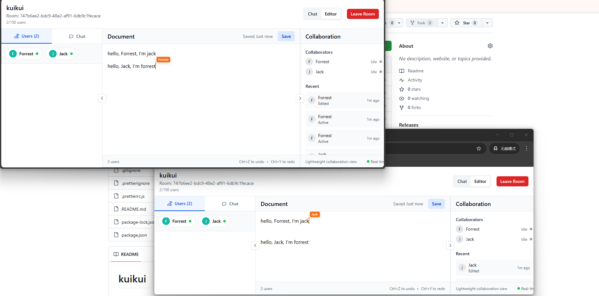

# kuikui

## Helloooo

This project is an anonymous real-time collaboration tool designed to allow
users to create and join shared workspaces without requiring authentication or
account creation. A user can create a collaboration room by entering a custom
name, and the system generates a unique shareable link. Others can join
instantly through the link and participate in real-time collaboration.

The tool leverages Node.js and WebSocket technology to provide seamless
real-time synchronization across multiple clients. It focuses on simplicity and
usability: no sign-ups, no passwords—just instant access.

The main use cases include:

- Quick brainstorming sessions

- Temporary collaboration in meetings

- Lightweight teamwork without administrative overhead

- Real-time note-taking or shared editing

The project will be developed with agile practices in mind, simulating
enterprise workflows (sprints, stories, and tasks). It will include a front-end
interface for creating/joining rooms, a back-end server for room and session
management, and support for real-time updates.

Future enhancements may include optional persistence, role management, and
integrations with third-party services.

## Demo

### 1. Initial Home Page


### 2. Create a Room


### 3. Send & Receive Message

 

### 4. Editor Mode


### 5. Collaboration



## Test Coverage

We maintain high test coverage to ensure reliability.

### Backend

| Type       | Percentage |
| ---------- | ---------- |
| Statements | 92.93%     |
| Branches   | 85.62%     |
| Functions  | 91.11%     |
| Lines      | 92.93%     |

### Frontend

| Type       | Percentage |
| ---------- | ---------- |
| Statements | 76.58%     |
| Branches   | 83.79%     |
| Functions  | 71.05%     |
| Lines      | 76.58%     |

To run coverage reports:

```bash
npm run test:coverage
```

## Available Scripts

In the project directory, you can run:

### Development

- `npm run dev`: Starts the development environment (backend + frontend) with
  auto-cleanup and env setup.
- `npm run dev:backend`: Starts only the backend development server.
- `npm run dev:frontend`: Starts only the frontend development server.

### Testing

- `npm test`: Runs all tests.
- `npm run test:watch`: Runs backend tests in watch mode.
- `npm run test:ui`: Opens Vitest UI for frontend tests.
- `npm run test:coverage`: Generates coverage reports.

### Code Quality

- `npm run lint`: Lints the codebase.
- `npm run format`: Formats the codebase using Prettier.
- `npm run type-check`: Runs TypeScript type checking.

### Utilities

- `npm run env:setup`: Generates .env files from examples.
- `npm run port:cleanup`: Kills processes occupying development ports.
